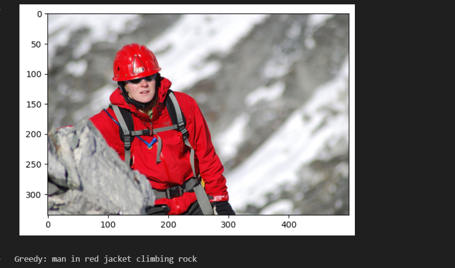
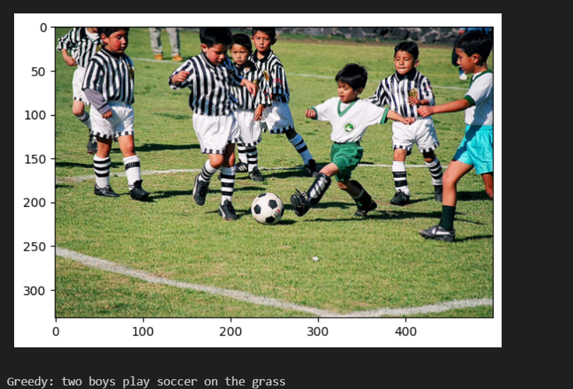
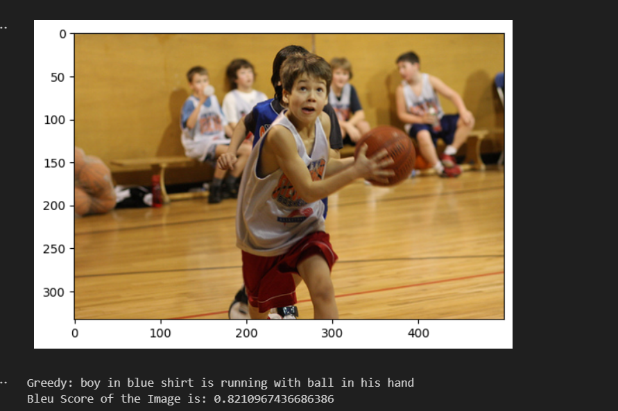
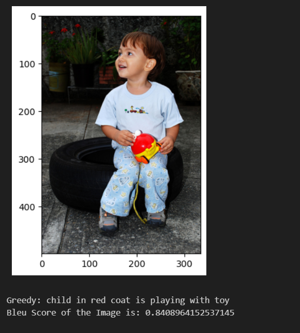

# Image-Captioning-with-RNNs

AIM: This project aims to build a image captioning system using CNNs and RNNs.

Experiments: This project has used ResNet50 and InceptionV3 models for feature extraction of images and LSTM for Natural Language processing task which is Captioning. Greedy search was used to predict the caption and BLEU score as used for evaluation. An average BLEU score of 0.545 was achieved.

Results:

